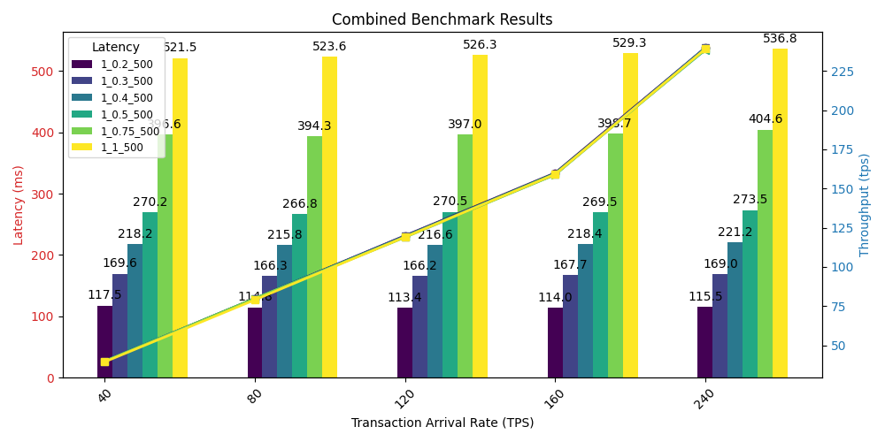
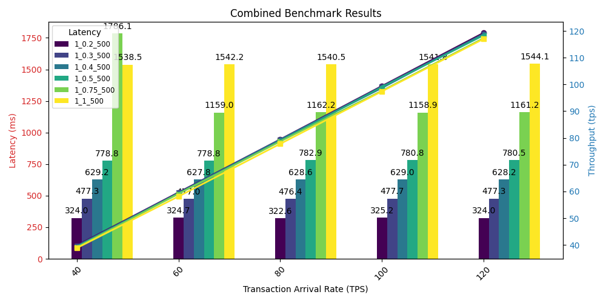
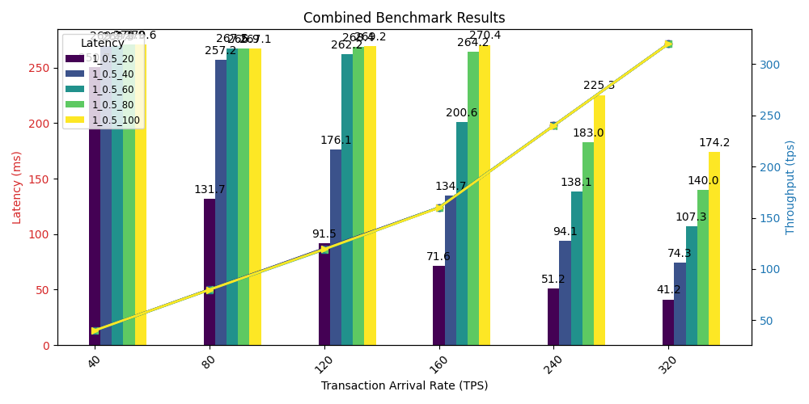
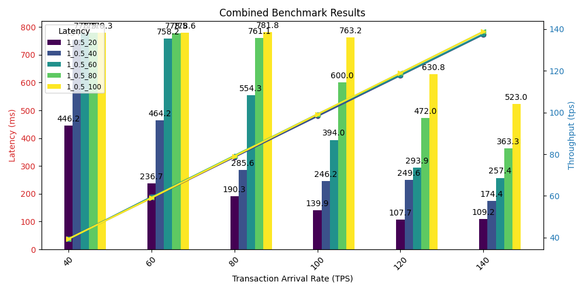
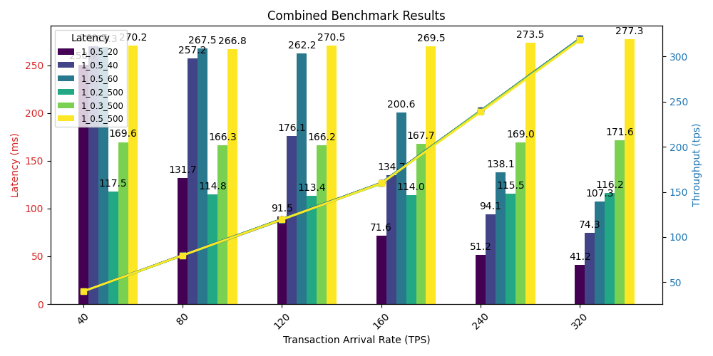
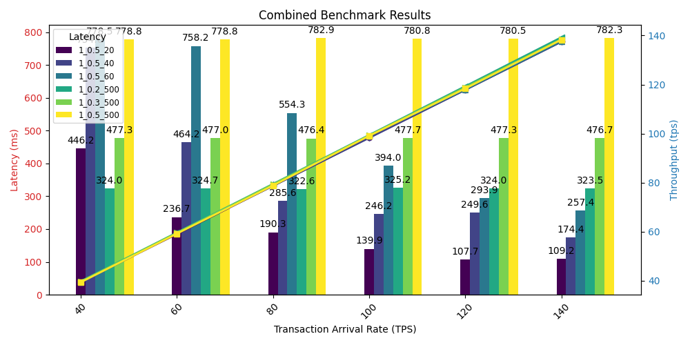

# Hyperledger Fabric Layer 1 Network Benchmarking Results

## Overview
Between April 6th and April 9th, 2024, an extensive benchmarking campaign was conducted on our Hyperledger Fabric Layer 1 [network](https://github.com/weids-dev/benchains/tree/main/networks/fabric). The focus of these benchmarks, executed via Vegeta for stress testing, was to understand the impact of variations in BatchTimeout, MaxMessageCount, and the number of endorsement nodes. The aim was to identify hardware bottlenecks, establish a solid performance baseline, and determine the optimal configurations that could facilitate efficient development of Layer 2 solutions.

## Key Findings

### 1. Endorsement Nodes
- There were negligible differences in latency between one and four endorsement nodes configurations, indicating that, under the test conditions, the hardware resources were not a limiting factor. This suggests that the number of endorsement nodes has a relatively minor impact on performance when hardware resources are sufficient.

### 2. Batch Timeout
- **Reducing BatchTimeout consistently lowered latency**, with an optimal setting at 0.2 seconds that **maintained constant latencies** between 115-120 milliseconds, even as transactions per second (TPS) increased from 40 to 480.

### 3. Block Size
- **Decreasing block size significantly benefited latency**, with the optimal size of 20 transactions per block. Notably, as the **TPS increased** from 80 to 480, **latency improved** dramatically, dropping from 133 milliseconds to 31 milliseconds.

## Implications

The findings clearly indicate that no single configuration fits all scenarios when optimizing network performance. The trade-off between BatchTimeout and Block Size is particularly notable, suggesting that **lower BatchTimeouts are advantageous at lower TPS ranges, while smaller block sizes are more efficient at higher TPS levels**. This intricate balance is essential for custom layer 1 configurations, allowing for the fine-tuning necessary to meet diverse application demands. These insights are also valuable for guiding the development of Layer 2 scaling strategies.

A potential application of these findings is evident in a plasma-like Layer 2 setup. For example, the main chain could benefit from a lower BatchTimeout to support applications with lower TPS and minimal latency. Meanwhile, for the child chain, which might handle a higher volume of transactions, a smaller block size configuration could minimize latency and boost performance.
